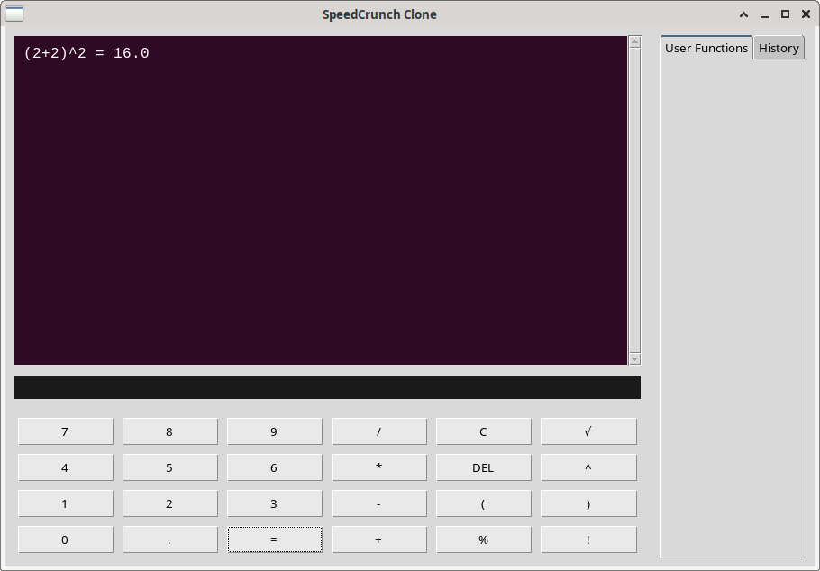

# SpeedCrunch Clone

A Python/Tkinter clone of the SpeedCrunch calculator, featuring a clean interface, calculation history, and keyboard shortcuts.


_Calculator Interface_

## Features

- 🧮 **Basic Arithmetic**: Addition, subtraction, multiplication, division
- ⚡ **Advanced Operations**: Power (^), square root (√), factorial (!), percentage (%)
- 👷📚 **Calculation History**: Persistent history with scrollable display
- ⌨️ **Keyboard Shortcuts**: Full keyboard support with shortcuts
- 🎨 **SpeedCrunch-like Interface**: Dark theme with purple accents
- 👷💾 **Session Management**: Load/save sessions (planned)
- 📋 **Copy/Paste**: Copy results and paste expressions
- 🔢 **Numpad Support**: Full numpad integration
- 🖱️ **Modular Architecture**: Clean, maintainable code structure

## Keyboard Shortcuts

| Shortcut                 | Action                   | Status         |
| ------------------------ | ------------------------ | -------------- |
| `Enter` / `Numpad Enter` | Calculate result         | ✅ Implemented |
| `Escape`                 | Clear input field        | ✅ Implemented |
| `Ctrl + C`               | Copy selected text       | ✅ Implemented |
| `Ctrl + R`               | Copy last result         | 🚧 Planned     |
| `Ctrl + V`               | Paste from clipboard     | ✅ Implemented |
| `Ctrl + A`               | Select all text in input | 🚧 Planned     |
| `Ctrl + N`               | Clear history            | 🚧 Planned     |
| `Ctrl + L`               | Load session             | 🚧 Planned     |
| `Ctrl + S`               | Save session             | 🚧 Planned     |
| `Ctrl + Q`               | Quit application         | 🚧 Planned     |
| `F11`                    | Toggle fullscreen        | 🚧 Planned     |

## Installation

1. **Clone the repository**:

   ```bash
   git clone https://github.com/martin-b-07e5/Calculator-tkinter.git
   cd Calculator-tkinter
   ```

2. **Run the application**:
   ```bash
   python main.py
   ```

### Requirements

- Python 3.8 or higher
- Tkinter (usually included with Python)

## Project Structure

```
Calculator-tkinter/
├── main.py                 # Main application entry point
├── button_frame.py         # Calculator button grid UI
├── button_handlers.py      # Button press logic and operations
├── result_frame.py         # History display and input field
├── side_panel.py           # Side panel with tabs
├── menu_bar.py             # Application menu bar (planned)
├── operations/             # Mathematical operations package
│   ├── arithmetic.py       # Basic arithmetic operations
│   ├── advanced.py         # Advanced mathematical functions
│   └── parsing.py          # Expression parsing and validation
└── resources/
    └── images/
        └── image.png       # Application screenshot
```

## Usage

### Basic Calculations

- **Arithmetic**: `2 + 3 * 4` = `14`
- **Parentheses**: `(2 + 3) * 4` = `20`
- **Decimal operations**: `10.5 + 2.3` = `12.8`

### Advanced Operations

- **Power**: `2 ^ 3` = `8`
- **❗Square Root**: `√16` = `4`
- **Factorial**: `5!` = `120`
- **Percentage**: `50%` = `0.5`
- **❗Complex expressions**: `(2 + 2)^2 + √16` = `20`

### Interface Features

- **History Panel**: All calculations are preserved in scrollable history
- **Input Field**: Single-line input for current expression
- **Button Layout**: Organized grid with color-coded operations
- **Side Panel**: Placeholder for future features (User Functions, History management)

## Architecture

The application follows a **modular MVVM-like pattern**:

### Core Components

- **`main.py`**: Application entry point and window management
- **`result_frame.py`**: View component for display and input
- **`button_frame.py`**: View component for calculator buttons
- **`button_handlers.py`**: ViewModel handling user actions
- **`operations/`**: Model layer for mathematical operations

### Key Design Patterns

- **Separation of Concerns**: UI logic separated from business logic
- **Single Responsibility**: Each file has a clear, focused purpose
- **Modular Operations**: Mathematical functions are easily extensible
- **Event-Driven Architecture**: Button clicks and keyboard events

### Code Style

- Follow PEP 8 guidelines
- Use type hints where appropriate
- Document all public functions with docstrings
- Keep functions focused and testable

## Current Status

### ✅ Implemented Features

- Basic arithmetic operations (+, -, \*, /)
- Advanced operations (^, √, %, !)
- Calculation history with scrollable display
- Keyboard shortcuts (Enter, Escape, Ctrl+C, Ctrl+V)
- Numpad support
- Error handling for invalid expressions
- Modular architecture

### 🚧 Planned Features

- Menu bar with full shortcut support
- Session save/load functionality
- Copy last result feature
- Select all text in input
- Clear history command
- Fullscreen mode
- User-defined functions
- Themes and customization
- Export functionality

### 🔮 Future Enhancements

- Scientific functions (trigonometry, logarithms)
- Unit conversions
- Constants library
- Plotting capabilities
- Plugin system

## Contributing

We welcome contributions! Please feel free to submit issues, feature requests, or pull requests.

### Development Setup

1. Fork the repository
2. Create a feature branch: `git checkout -b feature/new-feature`
3. Make your changes and test thoroughly
4. Commit your changes: `git commit -m 'Add new feature'`
5. Push to the branch: `git push origin feature/new-feature`
6. Submit a pull request

### Reporting Issues

When reporting issues, please include:

- Python version
- Operating system
- Steps to reproduce the issue
- Expected vs actual behavior

## License

This project is licensed under the MIT License - see the [LICENSE](LICENSE) file for details.

## Acknowledgments

- Inspired by [SpeedCrunch](http://speedcrunch.org/) - a great open-source calculator
- Built with **Python** and **Tkinter**
- Icons and design inspired by modern calculator interfaces
- Thanks to all contributors and testers
